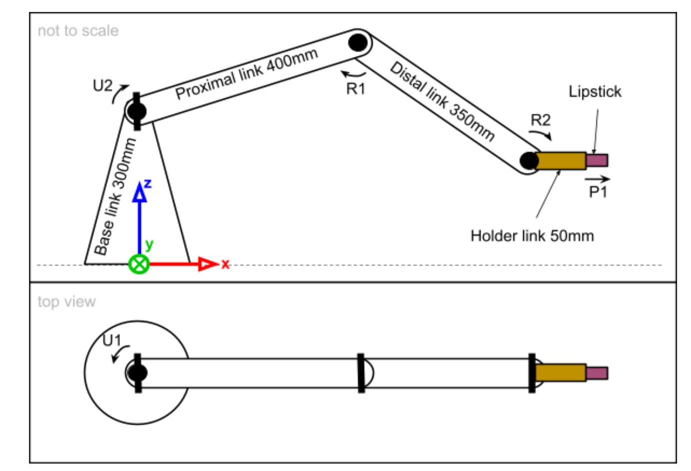

# forward-kinematics

## To build locally

`mkdir build && cd build`
`cmake .. && make && ./main_app`

### Run tests
`ctest`

## Run with Docker
- Prerequisite: Install Docker

`sudo docker build -t forward_kinematics .`

`sudo docker run --rm forward_kinematics`

## Improvements

`kinematic_chain` should be more generic to represent any robot. This can be achieved with DH parameters.
